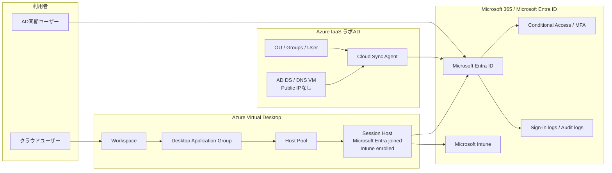

# Microsoft 365 / Entra ID / Intune / AVD / AD DS / Cloud Sync ラボポートフォリオ

## 要約

小規模企業向けの Microsoft 365 / Microsoft Entra ID / Microsoft Intune / Azure Virtual Desktop / AD DS / Microsoft Entra Cloud Sync 基盤を想定し、**要件整理、設計、構築、検証、Runbook化、公開用マスキング**までを個人ラボで再現したポートフォリオです。

主な成果は以下です。

- Microsoft Entra joined の Azure Virtual Desktop セッションホストを構成し、ユーザー接続、Intune登録、準拠状態、Start VM on Connectを検証。
- Azure上にAD DS / DNSラボドメインを構築し、Microsoft Entra Cloud Syncで選定ユーザーをEntra IDへ同期。
- On-demand provisioningだけを証跡にせず、通常同期ログとMicrosoft Graph確認で同期状態を補完。
- Password Hash Syncを有効化し、AD側パスワード再設定後にMicrosoftクラウドへサインインできることを確認。
- 検証後にAVD VM / DC VMをdeallocateし、ラボのコスト停止運用をRunbook化。

> このリポジトリは実案件の成果物ではありません。GitHub公開版では、スクリーンショット原本、CSV/JSON原本、Officeバイナリ、Tenant ID、Subscription ID、Object ID、Request ID、Correlation ID、SID、IPアドレス、UPN、トークン類を含めていません。

## 想定シナリオと前提

- 想定顧客は、Microsoft 365 Business Premiumを中心にID、端末管理、仮想デスクトップ、最小限のハイブリッドIDを整えたい小規模企業です。
- Business Premiumを前提にした理由は、Microsoft Entra ID、Conditional Access、Microsoft Intune、Microsoft Defender系機能を中小規模でも扱いやすい単位で説明できるためです。
- 本リポジトリは、実案件の本番構成ではなく、設計意図・検証観点・運用Runbookを説明する個人ラボです。
- 可用性、監視自動化、IaCによる完全再現、バックアップ/復旧試験は、実務拡張時の追加設計領域として扱います。

## 関連ポートフォリオ

| テーマ | リポジトリ | 主な観点 |
|---|---|---|
| Azure Governance / Policy Baseline | <https://github.com/rymo-az-hub/azure-platform-governance-portfolio> | Management Group、Azure Policy、RBAC、タグ、監視、コスト統制 |
| Microsoft 365 / AVD / AD DS / Cloud Sync | このリポジトリ | Entra ID、Intune、AVD、AD DS、Cloud Sync、PHS、CloudOps Runbook |

## まず見るファイル

| 順番 | ファイル | 用途 |
|---:|---|---|
| 1 | [アーキテクチャ](docs/architecture/architecture.md) | 全体構成と責任範囲の把握 |
| 2 | [P6 AVD完了サマリー](docs/summaries/P6_AVD_Completion_Summary.md) | AVD / Intune / Start VM on Connect検証の要約 |
| 3 | [P7 Cloud Sync / PHS完了サマリー](docs/summaries/P7_ADDS_CloudSync_PHS_Completion_Summary.md) | AD DS / Cloud Sync / PHS / Sign-in logs検証の要約 |
| 4 | [セキュリティ設計メモ](docs/security/Security_Design_Notes.md) | セキュリティ・運用設計上の注意点 |
| 5 | [Runbook一覧](docs/runbooks/README.md) | 運用手順と切り分け観点 |
| 6 | [公開用証跡サマリー](evidence/public/README.md) | 公開用に抽象化した検証証跡 |

## 構成図

## 完了範囲

| フェーズ | 範囲 | 状態 |
|---|---|---|
| P0-P5 | Microsoft 365 / Entra ID / Conditional Access / MFA / Intune初期設計 | 完了 |
| P6 | AVD Modern構成、Microsoft Entra joined session host、Intune準拠、Start VM on Connect | 完了 |
| P7-01 | AD DS / DNS用Azure VM構築 | 完了 |
| P7-02 | AD DS / DNS構成、ラボドメイン作成 | 完了 |
| P7-03 | OU / Group / User作成 | 完了 |
| P7-04 | Cloud Sync Agent導入、Agent Active確認 | 完了 |
| P7-05 | 同期対象グループとユーザーの事前確認 | 完了 |
| P7-06 | Cloud Sync Configuration作成、Security Groupスコープ設定 | 完了 |
| P7-07 | On-demand provisioning、通常同期、Provisioning logs、Graph確認 | 完了 |
| P7-08 | Password Hash Sync有効化とADパスワード再設定 | 完了 |
| P7-09 | Microsoftクラウドサインイン、Sign-in logs成功確認 | 完了 |
| P7-10 | AVD/DC VMセッション確認とdeallocate | 完了 |
| P8+ | WSUS / Azure Update Manager拡張 | この公開版では未実装 |

## このポートフォリオで示すこと

| 領域 | 示す内容 |
|---|---|
| Identity | Entra IDユーザー/グループ設計、Conditional Access/MFA設計、AD DSからEntra IDへのCloud Sync、PHSサインイン確認 |
| Endpoint / Device Management | Intune登録、AVD Session Hostの準拠状態確認 |
| Virtual Desktop | Microsoft Entra joined AVD、Workspace/DAG割り当て、Start VM on Connect、ユーザー接続確認 |
| Hybrid Identity | AD DS / DNSラボドメイン、Cloud Sync Agent、Security Groupスコープ、Provisioning logs、Graph検証 |
| Operations | Runbook、WBS、トラブルシュート、証跡要約、VM deallocateによるコスト停止 |
| Publication Control | スクリーンショット原本・生ログ・ID類を除外したGitHub公開構成 |

## 成果物リンク

| 区分 | ファイル |
|---|---|
| アーキテクチャ | [docs/architecture/architecture.md](docs/architecture/architecture.md) |
| P6要約 | [docs/summaries/P6_AVD_Completion_Summary.md](docs/summaries/P6_AVD_Completion_Summary.md) |
| P7要約 | [docs/summaries/P7_ADDS_CloudSync_PHS_Completion_Summary.md](docs/summaries/P7_ADDS_CloudSync_PHS_Completion_Summary.md) |
| Cloud Sync Runbook | [docs/runbooks/Runbook_CloudSync_ConfigAndVerify.md](docs/runbooks/Runbook_CloudSync_ConfigAndVerify.md) |
| PHS Runbook | [docs/runbooks/Runbook_CloudSync_PHS_SignIn_Validation.md](docs/runbooks/Runbook_CloudSync_PHS_SignIn_Validation.md) |
| Cost Stop Runbook | [docs/runbooks/Runbook_Lab_Cost_Stop.md](docs/runbooks/Runbook_Lab_Cost_Stop.md) |
| 要件整理 | [docs/deliverables/requirements.md](docs/deliverables/requirements.md) |
| 基本設計 | [docs/deliverables/basic-design.md](docs/deliverables/basic-design.md) |
| 試験計画・結果 | [docs/deliverables/test-plan-results.md](docs/deliverables/test-plan-results.md) |
| WBS | [docs/deliverables/wbs.md](docs/deliverables/wbs.md) |
| 公開用証跡要約 | [evidence/public/README.md](evidence/public/README.md) |
| セキュリティ設計メモ | [docs/security/Security_Design_Notes.md](docs/security/Security_Design_Notes.md) |

## 検証証跡の扱い

公開版では、実スクリーンショットやGraph/CSV/JSON原本は載せていません。公開用証跡は、以下のMarkdown要約に集約しています。

| 証跡要約 | 証明すること |
|---|---|
| [p6-avd-validation-summary.md](evidence/public/p6-avd-validation-summary.md) | AVD接続、Intune準拠、Start VM on Connect、deallocate検証 |
| [p7-cloudsync-provisioning-summary.md](evidence/public/p7-cloudsync-provisioning-summary.md) | Cloud Sync構成、On-demand provisioning、通常同期、Graph確認 |
| [p7-phs-signin-summary.md](evidence/public/p7-phs-signin-summary.md) | PHS有効化、ADパスワード再設定、クラウドサインイン成功 |
| [p7-cost-stop-summary.md](evidence/public/p7-cost-stop-summary.md) | AVD/DC VMのセッション確認とdeallocate結果 |

## ラボ判断と実務との差分

| 項目 | ラボ判断 | 実務想定 |
|---|---|---|
| Cloud Sync Agent配置 | DC同居。コスト優先の個人ラボ判断 | Tier 0資産としてハードニング。専用メンバーサーバー、複数Agent、変更管理を検討 |
| AD DS | 単一DC | 複数DC、バックアップ、監視、復旧試験、パッチ設計が必要 |
| 同期スコープ | Selected security groupで最小同期 | パイロットには有効。本番運用ではOU設計、グループ設計、変更管理を明確化 |
| VNet DNS | 本検証では広範囲に変更しない | AD DS名前解決やドメイン参加が必要なワークロードではCustom DNS設計が必要 |
| Start VM on Connect | ラボで有効化・検証 | Azure Virtual Desktop service principalへ`Desktop Virtualization Power On Contributor`を**subscription scope**で割り当てる前提を設計に含める |
| 監視 | Portal / Graph / Sign-in logsの手動確認 | Log Analytics、アラート、監査ログ保持、定期レビューを設計 |
| VM停止 | ラボのコスト停止としてdeallocate | 本番DCでは影響評価、復旧計画、メンテナンス手順なしに適用しない |

## 今後の拡張候補

| 優先度 | 拡張候補 | 理由 |
|---:|---|---|
| 高 | Log Analytics / Alert / Workbook | CloudOpsとして監視、検知、運用レビューまで説明できるようにするため |
| 中 | Bicep / Azure CLIによる再構築自動化 | 構築手順の再現性を上げ、IaC寄りの説明力を補強するため |
| 中 | AD DSバックアップ/復旧試験 | ラボのCloud Sync確認から、実務の復旧設計へ広げるため |
| 中 | WSUS / Azure Update Manager | Windows更新管理と運用設計のテーマへ拡張するため |

## 設計・運用上の判断ポイント

- なぜAVDをMicrosoft Entra joined構成にしたか。
- なぜAD DSはAVD前提ではなく、Hybrid Identity検証のために追加したか。
- なぜCloud SyncをSelected security groupで小さく始めたか。
- なぜOn-demand provisioningだけでScope証明を完了扱いにしなかったか。
- なぜPHS検証でSign-in logsまで確認したか。
- なぜスクリーンショット原本ではなく、公開用Markdown証跡に置換したか。
- 実務なら追加する可用性、監視、復旧、Break-glass、IaC、監査設計は何か。

## スクリプトの位置づけ

`scripts/`配下のPowerShellは、公開用に抽象化したサンプルです。実行結果にはUPN、Resource ID、同期属性、IPなどが含まれる場合があるため、**実行結果は公開リポジトリにコミットしない**前提です。
