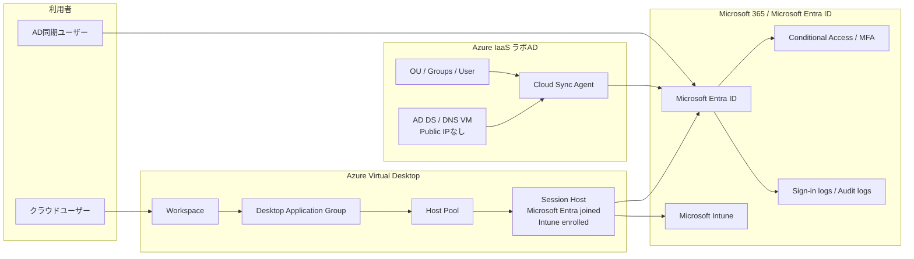

# アーキテクチャ概要

## スコープ

このポートフォリオは、小規模企業向けのMicrosoftクラウド基盤と軽量なHybrid Identity構成を想定した個人ラボです。

検証範囲は以下です。

- Microsoft 365 / Microsoft Entra IDのID基盤
- Conditional Access / MFA設計
- Microsoft Intuneによるデバイス管理と準拠確認
- Microsoft Entra joined session hostを用いたAzure Virtual Desktop
- Azure IaaS上のAD DS / DNSラボドメイン
- Microsoft Entra Cloud Sync
- Password Hash Syncのサインイン検証
- 検証後のVM deallocateによるラボコスト停止

## 論理構成

## 主なフロー

| フロー | 説明 |
|---|---|
| AVD接続 | クラウドユーザーがWorkspace / DAG経由でMicrosoft Entra joined session hostへ接続します。 |
| Intune管理 | Session HostはIntuneへ登録され、準拠状態を確認します。 |
| Cloud Sync | AD DS上の選定ユーザーをCloud Sync Agent経由でMicrosoft Entra IDへ同期します。 |
| PHS検証 | AD側パスワード再設定後、同期ユーザーでMicrosoftクラウドへサインインできることを確認します。 |
| 運用証跡 | Portal、Provisioning logs、Sign-in logs、Graph、Runbook結果を非公開原本として保持し、公開版では要約のみ掲載します。 |

## 設計上の境界

| 項目 | このラボでの扱い | 実務での追加検討 |
|---|---|---|
| AD DS | 単一DC | 複数DC、バックアップ、監視、復旧試験 |
| Cloud Sync Agent | DC同居 | Tier 0資産としての保護、専用サーバー、複数Agent |
| AVD | Microsoft Entra joined | SSO、FSLogix、プロファイル、監視、スケール計画 |
| 監査 | 手動確認と要約 | Log Analytics、アラート、保持期間、定期レビュー |
| IaC | この公開版では限定的 | Bicep/Terraform/GitHub Actionsによる再構築性 |
