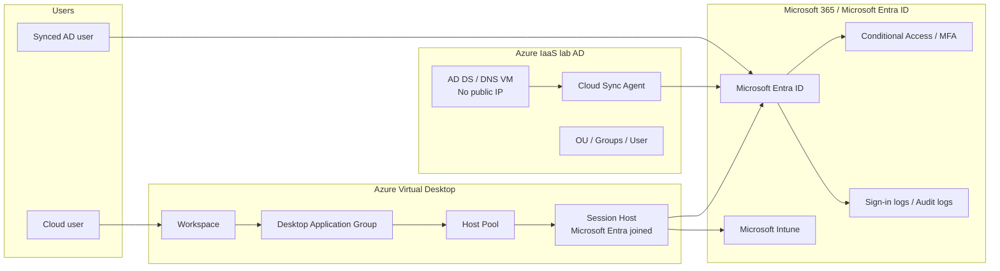

# Architecture Overview

## Scope

This portfolio models a small-business Microsoft cloud and hybrid identity platform.

The validation scope covers:

- Microsoft 365 / Microsoft Entra ID identity foundation
- Conditional Access / MFA design
- Intune device management and compliance
- Azure Virtual Desktop with Microsoft Entra joined session host
- AD DS / DNS lab domain
- Microsoft Entra Cloud Sync
- Password Hash Sync sign-in validation
- Lab VM cost-stop operation

## Logical architecture

## Main flows

| Flow | Description |
|---|---|
| AVD user access | User accesses AVD Workspace, DAG, and Microsoft Entra joined session host. |
| Device management | AVD session host is enrolled into Intune and evaluated by compliance policy. |
| Hybrid identity sync | AD DS user in the lab domain is synchronized to Microsoft Entra ID by Cloud Sync. |
| Password authentication | AD password change is synchronized through Password Hash Sync and validated with cloud sign-in. |
| Operations | VM state, AVD sessions, Cloud Sync health, and sign-in logs are checked through runbooks. |

## Design notes

- The session host is Microsoft Entra joined. This reduces dependency on AD DS line-of-sight for the AVD session host scenario validated here.
- AD DS is added for hybrid identity validation, not because the AVD session host requires AD domain join in this lab design.
- Cloud Sync is scoped to a selected security group for pilot-style validation.
- The Cloud Sync Agent is installed on the DC only for lab cost reduction. This is not presented as a production default.
- Public repository evidence is summarized as Markdown. Raw screenshots and raw logs are not included.
